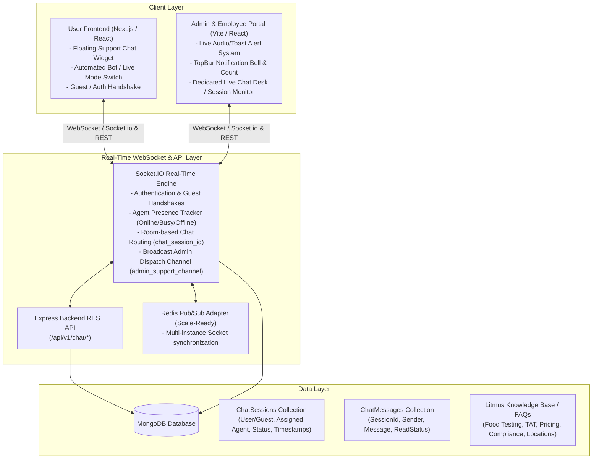
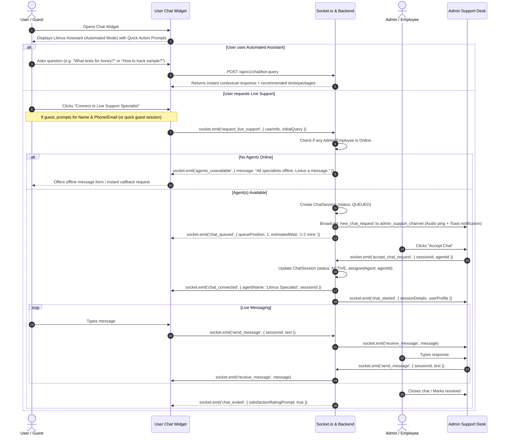

# Live Support Chat & Context-Aware Automated Bot System

## 1. Overview
The goal is to modernize the user-facing chat widget on the Litmus platform, introduce dual-mode chat (**Context-Aware Automated Bot** and **Live Agent Support** for both logged-in and guest users), and build a real-time **Admin & Employee Live Support Workspace** with instant notifications, chat queueing, agent assignment, and administrative tracking.

---

## 2. System Architecture & Scalability Strategy

### Scalability & Infrastructure Decision:
1. **Integrated WebSocket Server with Standalone Decoupling Pattern**:
   - We will attach `Socket.IO` to the Node.js / Express HTTP server (`http.createServer(app)`) using a clean modular service structure (`src/socket/index.ts`, `src/socket/chat.handler.ts`, `src/socket/presence.handler.ts`).
   - **Scale-Ready Architecture**: The socket handlers will be stateless with respect to connected instances by supporting the `@socket.io/redis-adapter` (or in-memory when single-node). When scaled to multiple server instances or containers in production, any instance can broadcast events across nodes seamlessly.
2. **Presence & Channel Isolation**:
   - `admin_support_channel`: All online Admin and Employee staff with support permissions join this channel upon login. When an incoming live chat is requested, an alert rings on all active agent devices.
   - `chat_session_{id}`: A private isolated room per conversation connecting the user/guest socket and the assigned agent socket.
   - Heartbeat & Auto-reconnect: Automatic reconnection with message queue replay so no messages are lost during brief network interruptions.

---

## 3. User Experience & Chat Flow

---

## 4. Key Features & Specifications

### 4.1. User-Facing Chat Widget Redesign
- **Ultra-Modern Glassmorphism & Litmus Theme**: Sleek floating pill/button with pulse glow, active online indicator, and responsive expand/collapse animations.
- **Dual Tab / Mode Switch**:
  - **Tab 1: Automated Assistant (Litmus Knowledge Bot)**:
    - Pre-configured dynamic quick chips (*"Book a Test"*, *"Sample Collection Process"*, *"Check Report Status"*, *"FSSAI / NABL Compliance"*, *"Pricing & Turnaround Time"*).
    - Natural language query resolution matching Litmus services, lab network, food testing categories, and booking workflows.
    - Seamless fallback button: *"Talk to a Human Specialist"* anytime.
  - **Tab 2: Live Support Agent**:
    - Automatic identification: If logged in, inherits user name, phone, email, and recent bookings context.
    - Guest Mode: Quick 2-field form (Name & Mobile/Email) with guest session token persistence in `localStorage`.
    - Waiting screen with live queue position and friendly animated pulse.
    - Live Agent view with agent avatar, real-time typing indicators, read receipts, and file attachment support (e.g. photos of samples, test requirements).

### 4.2. Admin & Employee Live Support System
- **Real-Time Notification Bar & TopNavbar Integration**:
  - Sound chime (toggleable) + browser notification + badge counter on incoming live chat requests.
  - Quick popup preview in top navbar: *"New chat request from [User Name] - [Accept] / [Dismiss]"*.
- **Admin Support Desk Page (`/admin/live-support`)**:
  - **3-Column Workspace**:
    1. **Sessions Queue**:
       - *Incoming Requests (Ringing / Queued)*
       - *My Active Chats*
       - *Other Agents' Active Chats* (Supervision view for Admin)
       - *Resolved / History*
    2. **Active Chat Window**:
       - Real-time chat stream with timestamps, status tags, and typing indicator.
       - Canned quick responses (e.g., greeting, turnaround times, sample dispatch instructions).
       - Transfer Chat to another employee/agent.
       - End Chat / Mark as Resolved with summary notes.
    3. **Customer & Context Sidebar**:
       - User profile (Name, Email, Phone, User type: Registered vs Guest).
       - Quick booking history & pending tests (if registered user).
       - Internal agent notes (visible only to admins and employees, never shown to user).
- **Agent Presence Management**:
  - Presence status switch in top bar: **Online (Accepting Chats)** / **Busy (In Chat)** / **Offline**.
  - Auto-away timeout if idle.

---

## 5. Technical Implementation Plan

### Phase 1: Backend WebSocket & Chat Architecture
- **Dependencies**: Install `socket.io` and `@types/socket.io` in `backend`.
- **Database Models (`backend/src/models`)**:
  - `ChatSession.ts`:
    - `sessionId`: Unique UUID / string.
    - `userType`: `'REGISTERED' | 'GUEST'`.
    - `userId` (optional ref User), `guestInfo` (name, phone, email, deviceMeta).
    - `status`: `'QUEUED' | 'ACTIVE' | 'RESOLVED' | 'MISSED' | 'BOT'`.
    - `assignedAgent`: Ref User (Employee or Admin).
    - `startedAt`, `endedAt`, `resolutionNotes`.
  - `ChatMessage.ts`:
    - `sessionId`: Ref ChatSession.
    - `senderType`: `'USER' | 'AGENT' | 'BOT' | 'SYSTEM'`.
    - `senderId` (optional ref User).
    - `text`: String.
    - `attachments`: Array of URLs/types.
    - `isInternalNote`: Boolean (for agent-only private notes).
    - `readAt`: Date.
  - `ChatBotFAQ.ts` / Knowledge Engine:
    - Pre-defined categorized intents and answers for Litmus (Food testing, water testing, nutritional facts, FSSAI compliance, lab accreditation, turnaround times, pricing, sample courier instructions).
- **Socket Engine (`backend/src/socket`)**:
  - `initSocket(httpServer)`: Attach Socket.io with CORS credentials.
  - `presence.handler.ts`: Track online agents, user connections, heartbeat.
  - `chat.handler.ts`: Handle `request_live_support`, `accept_chat`, `send_message`, `typing_indicator`, `close_chat`.
- **REST Endpoints (`backend/src/controllers/chat.controller.ts` & `backend/src/routes/chat.routes.ts`)**:
  - `POST /api/v1/chat/bot-query`: Context-aware bot response.
  - `GET /api/v1/chat/sessions`: Fetch sessions list (filtered by status, agent).
  - `GET /api/v1/chat/sessions/:id/messages`: Fetch historical messages for session.
  - `GET /api/v1/chat/agents/online`: Check online agent availability.
  - `POST /api/v1/chat/sessions/:id/notes`: Add internal admin/employee note.

### Phase 2: User-Frontend Support Chat Redesign
- **Dependencies**: Install `socket.io-client` in `user-frontend`.
- **Files to Redesign & Build (`user-frontend/src/components/layout/support-chat/`)**:
  - `SupportChatTrigger.tsx`: Premium animated floating button with notification badge & ripple effect.
  - `SupportChatWindow.tsx`: Complete overhaul with tabbed structure:
    - Mode 1: Automated Litmus Pathology & Lab AI Assistant with interactive quick replies.
    - Mode 2: Live Support Agent request screen, queue animation, live chat window.
  - `GuestAuthModal.tsx`: Minimal clean sheet/modal for guest info before joining live queue.
  - `useSocketChat.ts`: Custom React hook managing socket connection, reconnects, message state, sound alerts, and typing states.

### Phase 3: Admin & Employee Panel Live Support Desk
- **Dependencies**: Install `socket.io-client` in `admin-frontend`.
- **Components & Pages (`admin-frontend/src/`)**:
  - `context/SocketContext.tsx`: Global socket provider for Admin/Employee presence, sound alerts, and real-time event dispatching.
  - `components/layout/TopNavbar.tsx`: Real-time chat notification pill with audio chime and one-click quick accept modal.
  - `components/layout/SidebarNav.tsx`: Add "Live Support" menu item with real-time active queue badge.
  - `pages/admin/LiveSupportPage.tsx`: Full-featured 3-pane support workstation (Queue / Active Chat / User Intelligence & Notes).
  - Agent Presence Switch in Admin UI (Online / Busy / Offline).

---

## 6. Proposed Changes Breakdown

### Backend
#### [NEW] [ChatSession.ts](file:///c:/Users/mdont/OneDrive/Desktop/Projects/13.Litmus/backend/src/models/ChatSession.ts)
#### [NEW] [ChatMessage.ts](file:///c:/Users/mdont/OneDrive/Desktop/Projects/13.Litmus/backend/src/models/ChatMessage.ts)
#### [NEW] [chat.service.ts](file:///c:/Users/mdont/OneDrive/Desktop/Projects/13.Litmus/backend/src/services/chat.service.ts)
#### [NEW] [botKnowledge.service.ts](file:///c:/Users/mdont/OneDrive/Desktop/Projects/13.Litmus/backend/src/services/botKnowledge.service.ts)
#### [NEW] [socket/index.ts](file:///c:/Users/mdont/OneDrive/Desktop/Projects/13.Litmus/backend/src/socket/index.ts)
#### [NEW] [socket/chat.handler.ts](file:///c:/Users/mdont/OneDrive/Desktop/Projects/13.Litmus/backend/src/socket/chat.handler.ts)
#### [NEW] [controllers/chat.controller.ts](file:///c:/Users/mdont/OneDrive/Desktop/Projects/13.Litmus/backend/src/controllers/chat.controller.ts)
#### [NEW] [routes/chat.routes.ts](file:///c:/Users/mdont/OneDrive/Desktop/Projects/13.Litmus/backend/src/routes/chat.routes.ts)
#### [MODIFY] [server.ts](file:///c:/Users/mdont/OneDrive/Desktop/Projects/13.Litmus/backend/src/server.ts) & [app.ts](file:///c:/Users/mdont/OneDrive/Desktop/Projects/13.Litmus/backend/src/app.ts)

### User Frontend
#### [NEW] [useSocketChat.ts](file:///c:/Users/mdont/OneDrive/Desktop/Projects/13.Litmus/user-frontend/src/hooks/useSocketChat.ts)
#### [MODIFY] [FloatingSupportChat.tsx](file:///c:/Users/mdont/OneDrive/Desktop/Projects/13.Litmus/user-frontend/src/components/layout/FloatingSupportChat.tsx)
#### [MODIFY] [SupportChatTrigger.tsx](file:///c:/Users/mdont/OneDrive/Desktop/Projects/13.Litmus/user-frontend/src/components/layout/support-chat/SupportChatTrigger.tsx)
#### [MODIFY] [SupportChatWindow.tsx](file:///c:/Users/mdont/OneDrive/Desktop/Projects/13.Litmus/user-frontend/src/components/layout/support-chat/SupportChatWindow.tsx)
#### [NEW] [BotChatView.tsx](file:///c:/Users/mdont/OneDrive/Desktop/Projects/13.Litmus/user-frontend/src/components/layout/support-chat/BotChatView.tsx)
#### [NEW] [LiveChatView.tsx](file:///c:/Users/mdont/OneDrive/Desktop/Projects/13.Litmus/user-frontend/src/components/layout/support-chat/LiveChatView.tsx)

### Admin Frontend
#### [NEW] [SocketContext.tsx](file:///c:/Users/mdont/OneDrive/Desktop/Projects/13.Litmus/admin-frontend/src/context/SocketContext.tsx)
#### [NEW] [LiveSupportPage.tsx](file:///c:/Users/mdont/OneDrive/Desktop/Projects/13.Litmus/admin-frontend/src/pages/admin/LiveSupportPage.tsx)
#### [MODIFY] [TopNavbar.tsx](file:///c:/Users/mdont/OneDrive/Desktop/Projects/13.Litmus/admin-frontend/src/components/layout/TopNavbar.tsx)
#### [MODIFY] [SidebarNav.tsx](file:///c:/Users/mdont/OneDrive/Desktop/Projects/13.Litmus/admin-frontend/src/components/layout/SidebarNav.tsx)
#### [MODIFY] [App.tsx](file:///c:/Users/mdont/OneDrive/Desktop/Projects/13.Litmus/admin-frontend/src/App.tsx)

---

## 7. Verification & Testing Plan

### Automated & Unit Verification
1. **Backend Integration Tests**:
   - Test `POST /api/v1/chat/bot-query` with various test inquiries and verify contextual structured replies.
   - Test socket event lifecycle (`request_live_support` -> `new_chat_request` -> `accept_chat_request` -> `send_message` -> `close_chat`).
2. **Type Safety & Build Checks**:
   - Run `npm run build` in `backend`, `user-frontend`, and `admin-frontend`.

### Manual End-to-End Flow Verification
1. **Automated Bot Test**:
   - Open User Frontend -> Click chat widget -> Interact with quick suggestions -> Verify automated instant accurate replies.
2. **Live Chat Flow (Guest & Logged-in)**:
   - Connect as Guest in incognito browser -> Click "Talk to Live Support".
   - Verify Admin/Employee receives real-time audio chime + banner alert in Admin Panel.
   - Admin accepts chat -> live two-way message exchange with typing indicators.
   - Admin views guest IP/metadata & adds private internal note.
   - Admin resolves chat -> User receives resolution notification & rating prompt.
